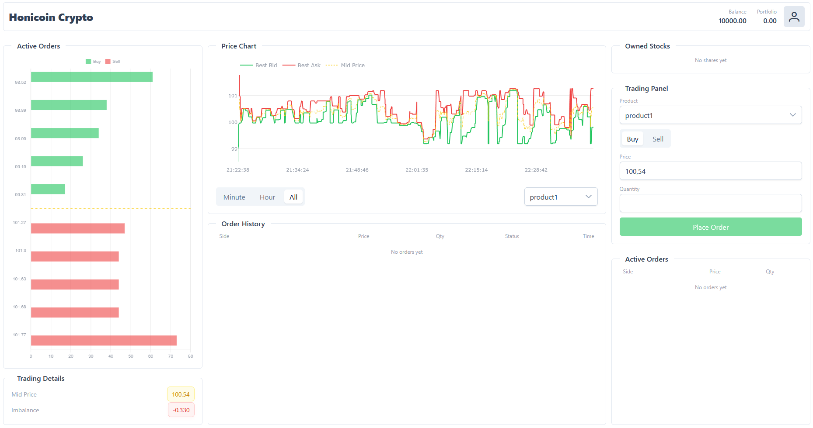

# Multi-Product Exchange Simulator for an Order-Driven Market

A multi-product exchange simulator for a limit order book (LOB) driven market.

This project extends the simulator introduced in *Burzovní simulátor pro trh řízený limitními objednávkami*. 
>KIMLOVÁ, Vladimíra. Burzovní simulátor pro trh ́řízený limitníımi objednávkami. Západočeská univerzita v Plzni, 2025. Also available [here](http://hdl.handle.net/11025/640100).

The objective is to design, implement, secure, and experimentally validate a multi-asset exchange simulation platform supporting both autonomous and manual trading agents.



---

## Table of Contents

- [Project Objectives](#project-objectives)
- [System Architecture](#system-architecture)
  - [Exchange Server](#exchange-server)
  - [Trading Agents](#trading-agents)
  - [Visualization Layer](#visualization-layer)
  - [Reporting & Analytics](#reporting--analytics)
- [Security Considerations](#security-considerations)
- [Research & Educational Use](#research--educational-use)
- [Technologies Used](#technologies-used)
- [Getting Started](#getting-started)
  - [1. Clone the Repository](#1-clone-the-repository)
  - [2. Install Dependencies](#2-install-dependencies)
  - [3. Configuration](#3-configuration)
  - [4. Start the Exchange Server](#4-start-the-exchange-server)
  - [5. Run Trading Agents](#5-run-trading-agents)
  - [6. Launch the Web Interface](#6-launch-the-web-interface)
- [Simulation Analysis](#simulation-analysis)
- [Running Tests](#running-tests)
- [Reference](#reference)
- [Documentation](#documentation)

---

## Project Objectives

The project is based on the following principles:

1. **Study of existing open-source order-driven exchange simulators**, particularly those based on order book processing.
2. **Design and implementation of an extended simulator** that:
   - Supports trading of multiple products simultaneously.
   - Enables interaction of autonomous (algorithmic) and manual trading agents.
   - Allows scalable and distributed deployment.
3. **Server security hardening**, ensuring full functionality even when the source code is publicly available.
4. **Organization of a student trading competition**, utilizing suitable computing infrastructures (e-INFRA CZ, MetaCentrum), including:
   - Collection of simulation data.
   - Generation of structured statistical reports.
   - Visualization and cross-product comparison of trading strategy performance.
5. **Comprehensive documentation** of methodologies, design decisions, and achieved results.

---

## System Architecture

The simulator is modular and consists of the following components:

### Exchange Server

- Maintains multiple independent order books (one per product).
- Implements a matching engine based on **price-time priority**.
- Validates and records incoming orders.
- Stores simulation state and transaction history.

### Trading Agents

- Autonomous algorithmic agents (e.g., market maker, liquidity provider).
- Support for custom strategies, including ML-based approaches.
- Manual trading interface for interactive participation.

### Visualization Layer

- Real-time monitoring of market activity.
- Order book depth visualization.
- Trade history and performance tracking.

### Reporting & Analytics

- Statistical post-processing of simulation runs.
- Comparative analysis of strategies.
- Cross-product performance evaluation.

---

## Security Considerations

Special emphasis is placed on:

- Strict separation of server and client logic.
- Robust order validation and input sanitization.
- Prevention of manipulation through protocol-level safeguards.
- Controlled API exposure and configurable access policies.
- Ensuring market integrity despite open-source availability.

The system is designed to remain fair, stable, and operational even under adversarial conditions.

---

## Research & Educational Use

The platform enables:

- Study of market microstructure.
- Analysis of liquidity formation and price dynamics.
- Evaluation of trading algorithm stability.
- Cross-product strategy comparison.
- Organization of educational exchange simulations.
- Experimental regulatory and stress-testing scenarios.

---

## Technologies Used

- **Python 3.11.9
- **Tornado** (asynchronous web server)
- **Vue.js** (web frontend)
- **NumPy**, **Pandas** (data processing)
- **Jupyter Notebook** (analysis & reporting)

---

## Getting Started

### 1. Clone the Repository

```bash
git clone https://github.com/Jivl00/limit-order-book-simulator
cd limit-order-book-simulator
```

---

### 2. Install Dependencies

**Server (Python):**
```bash
pip install -r requirements.txt
```

**Frontend (Vue.js):**
```bash
cd src/market-frontend
bun install
```
> devnote: bun is my personal to-go choice, but can ofcourse use other runtimes aswell

---

### 3. Configuration

Copy `.env.example` to `.env` and fill in your values:

```bash
cp .env.example .env
```

You can and should configure `.env`:

- Server host and port
- JWT and cookie secrets
- Allowed email domains
- Bot credentials
- CORS origin and HTTPS flag

Application parameters (products, fees, budgets) are configured in `config/server_config.json`.

---

### 4. Start the Exchange Server

```bash
cd src
python server/server.py
```

To resume a previous simulation state:

```bash
python server/server.py -l
```

Simulation data are stored in: `data/`

---

### 5. Run Trading Agents

Example:

```bash
python server/agents/market_maker.py
python server/agents/liquidity_generator.py
```

Custom agents can be implemented in: `client/agents/`. You can use `example_trader.py` as template.

---

### 6. Launch the Web Interface

```bash
cd src/market-frontend
bun run dev
```

Access via: `http://<IP_ADDRESS>:3000`

---

## Simulation Analysis

Open the reporting notebook: `src/report/report.ipynb`

The notebook allows:

- Strategy performance comparison
- Volume and trade frequency analysis
- Statistical summary generation
- Visualization of price evolution and liquidity metrics


---

## Running Tests

```bash
cd tests
python -m unittest tests.py
```

---

## Reference

Kimlová, V. (2025).  
*Burzovní simulátor pro trh řízený limitními objednávkami*.  
University of West Bohemia, Faculty of Applied Sciences.  
Supervisor: J. Pospíšil.

Also available [here](http://hdl.handle.net/11025/640100)

---

## Documentation

- Trading manual: [Wiki](https://github.com/MrEll3n/limit-order-market-simulator/wiki/Honicoin-Crypto-User-Manual) or [user_manual.md](https://github.com/MrEll3n/limit-order-market-simulator/blob/main/docs/user_manual.md)
- Thesis document: [db_2024_25_KIMLOVÁ_Vladimíra.pdf](https://github.com/MrEll3n/limit-order-market-simulator/blob/main/docs/dp_2024_25_KIMLOV%C3%81_Vladim%C3%ADra.pdf)
- Poster: [DP_poster.pdf](https://github.com/MrEll3n/limit-order-market-simulator/blob/main/docs/DP_poster.pdf)
